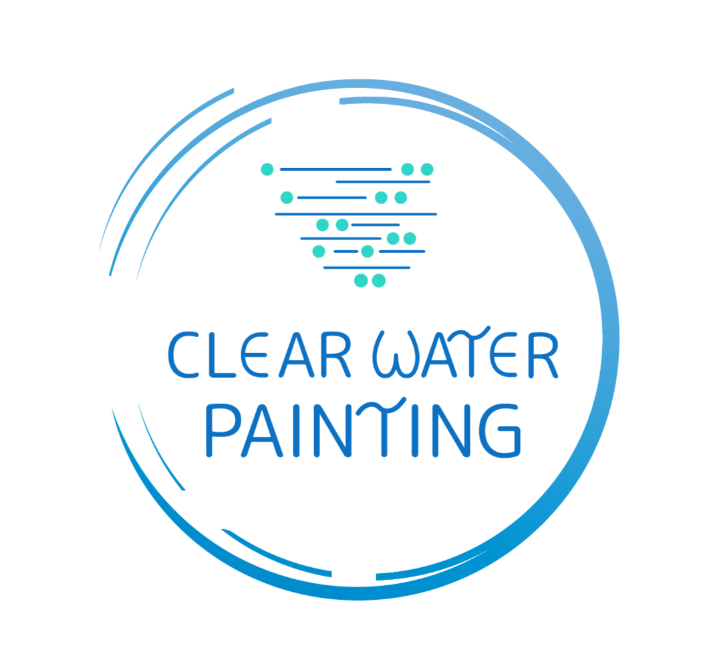

# Clear Water Painting

Landing page for [Clear Water Painting](https://clearwaterpainting.ca), a residential and commercial painting company based in Courtenay, British Columbia.

---

## Overview

This project started as a practical problem: the business was paying for a Wix subscription that was cost-prohibitive for a small seasonal company, and the platform provided no flexibility over the frontend, backend, or infrastructure. The goal was to migrate to a fully self-managed stack — custom HTML/CSS/JS frontend hosted on AWS — with a longer-term plan to rebuild in React.

---

## Roadmap

The frontend is being rebuilt as a React application before being redeployed. The planned stack for v2:

- **React** — component-based frontend
- **AWS EC2 + NGINX** — self-managed hosting (or Vercel for simplified deployment)

---

## Background

### Why migrate away from Wix?

Wix worked as a starting point but had two core problems: the monthly cost didn't make sense for a business that operates seasonally, and there was no way to own the infrastructure or extend the application beyond what the platform allowed. Moving to a custom AWS setup eliminated the recurring platform cost and gave full control over how the site is built, served, and scaled.

### AWS setup

The site is served from an EC2 instance with static assets stored in S3. Route 53 handles DNS and routes traffic to the instance. IAM roles and policies are used to manage access between services securely, following the principle of least privilege.

---

*Logo designed by Kylea Archer.*
